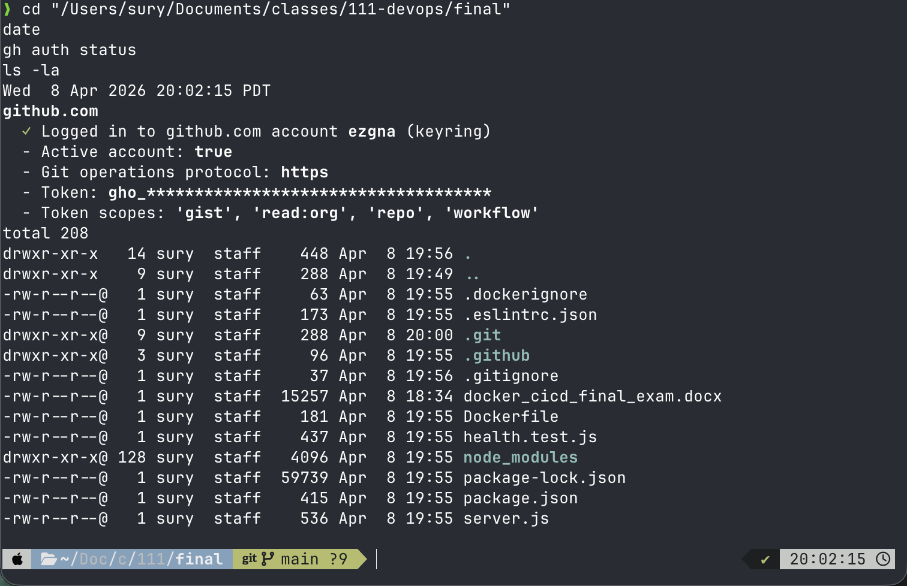
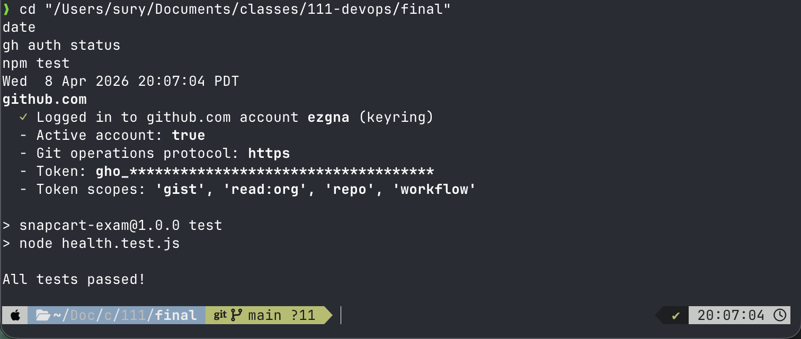
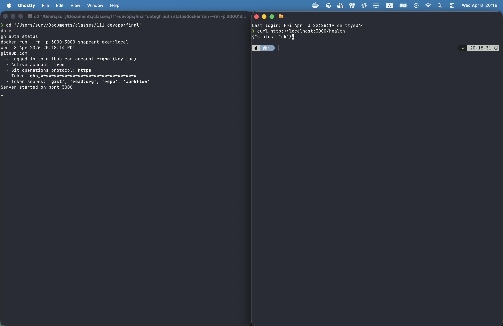
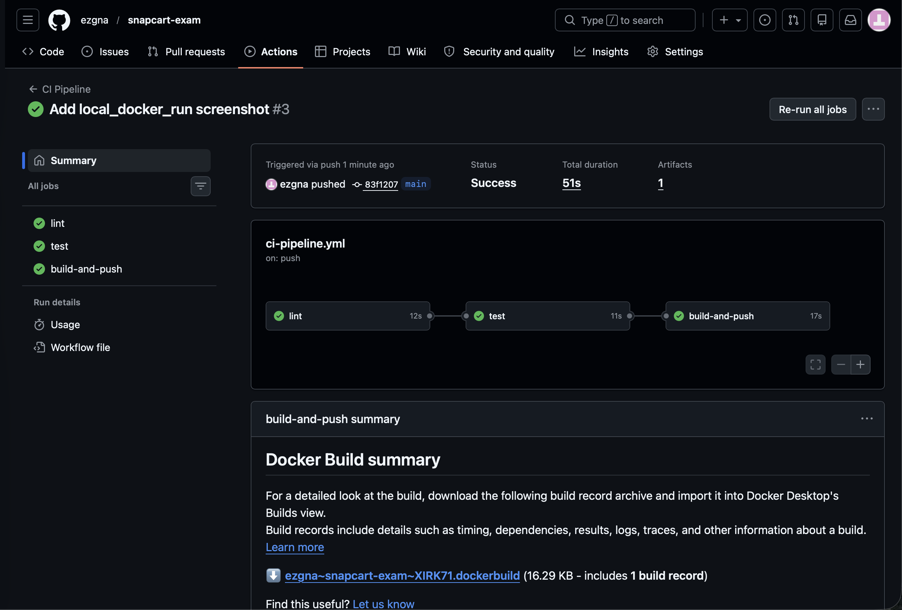
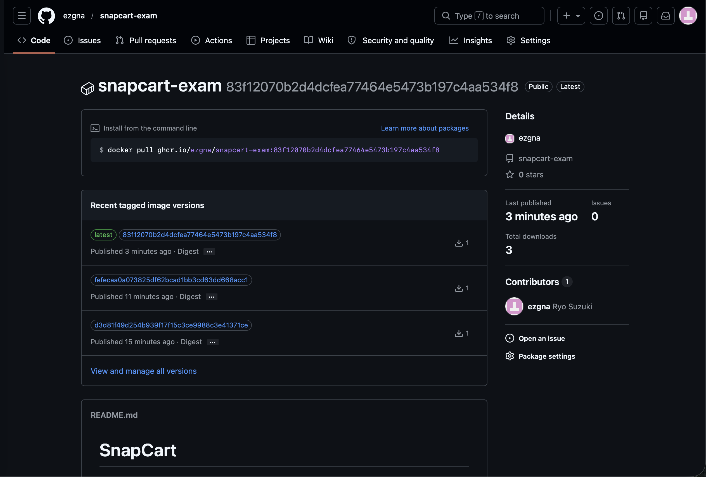

# SnapCart

Node.js app with Docker and GitHub Actions (lint → test → Docker build & push to GHCR).

## Screenshots

### 1. Project structure

### 2. Local tests

### 3. Local Docker

### 4. CI (all jobs green)

### 5. GHCR package

